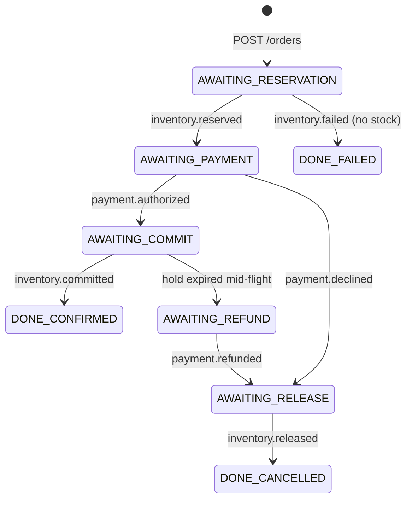
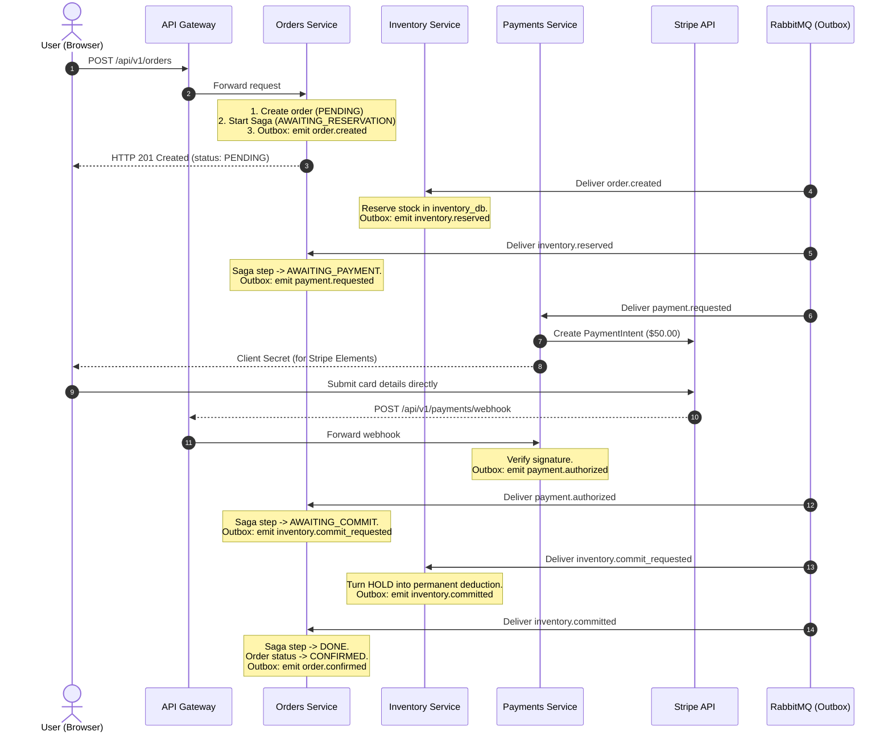
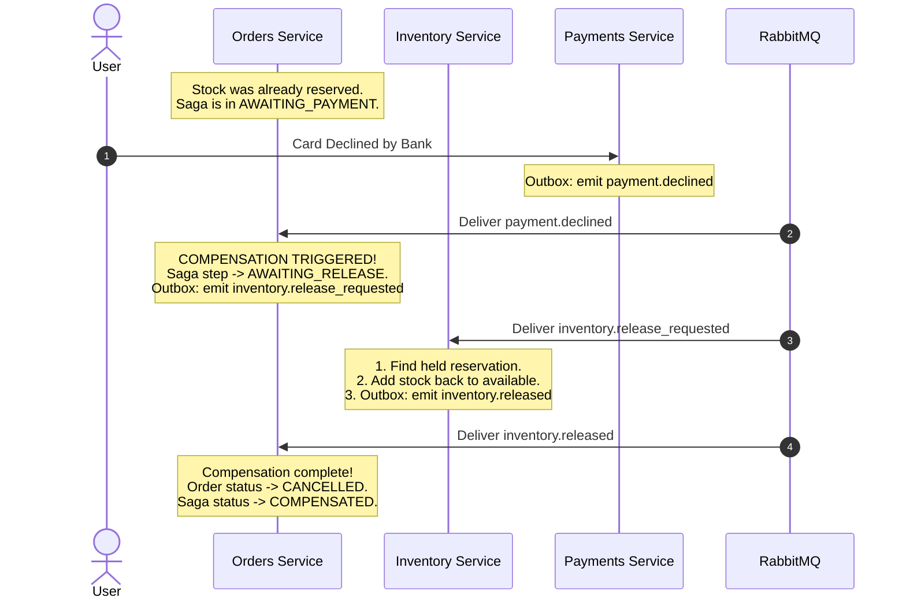

# Master Self-Study Guide: E-Commerce Microservices & Distributed Systems

> **Audience:** Computer Science / Software Engineering Student (Year 2+)  
> **Repository:** `ecommerce-microservices`  
> **Goal:** Understand every design pattern, distributed systems concept, architecture decision, and line of code that powers this production-grade microservices project.

---

## Table of Contents
1. [The Big Picture: Why Not Just Build a Monolith?](#1-the-big-picture-why-not-just-build-a-monolith)
2. [The Core Problem: Distributed Transactions & The Death of ACID](#2-the-core-problem-distributed-transactions--the-death-of-acid)
3. [Architecture Overview: Who Does What?](#3-architecture-overview-who-does-what)
4. [Pillar 1: The Saga Pattern (Orchestration vs Choreography)](#4-pillar-1-the-saga-pattern-orchestration-vs-choreography)
5. [Pillar 2: The Transactional Outbox Pattern](#5-pillar-2-the-transactional-outbox-pattern)
6. [Pillar 3: Idempotent Consumers (At-Least-Once Delivery)](#6-pillar-3-idempotent-consumers-at-least-once-delivery)
7. [Pillar 4: Concurrency & Contention (Coupons, Holds & Sweeps)](#7-pillar-4-concurrency--contention-coupons-holds--sweeps)
8. [Service-by-Service Deep Dive (The Code Tour)](#8-service-by-service-deep-dive-the-code-tour)
9. [Step-by-Step Order Lifecycle (Sequence Diagrams)](#9-step-by-step-order-lifecycle-sequence-diagrams)
10. [Glossary of Essential Terms](#10-glossary-of-essential-terms)
11. [Hands-On Lab Experiments You Can Run Locally](#11-hands-on-lab-experiments-you-can-run-locally)

---

## 1. The Big Picture: Why Not Just Build a Monolith?

In typical university coursework, you build a **monolithic application**:
- A single backend server (e.g., Express, NestJS, Spring Boot, or Django).
- A single database (e.g., PostgreSQL or MySQL).
- Every table (`users`, `products`, `orders`, `inventory`, `payments`) lives in the **same database**.

### How checkout works in a monolith:
```sql
BEGIN TRANSACTION;
  -- 1. Deduct 2 units of product stock
  UPDATE inventory SET stock = stock - 2 WHERE product_id = 'XYZ' AND stock >= 2;

  -- 2. Create the order
  INSERT INTO orders (id, user_id, total) VALUES ('ord_123', 'usr_1', 5000);

  -- 3. Charge the customer's credit card
  -- (If this fails, throw an error)

COMMIT; -- If anything fails, ROLLBACK undoes EVERYTHING automatically!
```

This is called **ACID Atomicity**: either everything succeeds, or the database automatically rolls back every change as if nothing ever happened.

### The Real-World Dilemma:
As companies scale:
1. **Independent Teams:** A team of 50 developers working on a single repository constantly conflicts on database schemas and deployments.
2. **Scalability:** The catalog service gets 10,000 read requests per second (browsing items), while the checkout service gets 50 writes per second. In a monolith, you have to scale the entire monolithic application together.
3. **Database-per-Service Pattern:** To make microservices truly independent, **each microservice owns its own private database**. No other service can read or write to another service's database directly!

---

## 2. The Core Problem: Distributed Transactions & The Death of ACID

The moment you separate your app into:
- `orders-service` (owns `orders_db`)
- `inventory-service` (owns `inventory_db`)
- `payments-service` (owns `payments_db` + communicates with Stripe's external API)

**You can NO LONGER do a SQL `BEGIN TRANSACTION` across them!**

### The "Split-Brain" / Orphaned Stock Disaster (The Experiment in ADR-0002)
Imagine writing simple synchronous code in `orders-service`:

```typescript
// NAIVE CODE (DO NOT DO THIS)
async function checkout(orderData) {
  // Step 1: Call inventory-service via HTTP
  await httpClient.post('http://inventory-service/reserve', { qty: 2 });
  // (Inventory committed in inventory_db: stock is now held!)

  // Step 2: Call payments-service via HTTP
  await httpClient.post('http://payments-service/charge', { amount: 50 });
  // OOPS! Card declined! Or network blip! Or payments-service crashed!

  // Step 3: Throw error
  throw new Error("Payment failed!");
}
```

What happened in the database?
1. `inventory_db` has already decremented or reserved the stock.
2. `orders-service` threw an error and created a `status = 'failed'` order.
3. **The 2 reserved units are permanently stuck (orphaned) in `inventory_db`!**
4. Nobody released them. Customers browsing the store cannot buy those 2 items because the inventory thinks they are reserved.

Why not use **Two-Phase Commit (2PC)**?
- 2PC locks database rows across multiple servers over the network.
- If one network connection is slow or a node hangs, the entire system grinds to a halt.
- Furthermore, **Stripe cannot participate in a 2PC transaction**. You cannot tell Stripe: *"Hey Stripe, prepare to charge this card, lock the money, wait 10 seconds for my database, and then commit."*

Therefore, distributed systems must use **Eventual Consistency** and the **Saga Pattern**.

---

## 3. Architecture Overview: Who Does What?

This project consists of 9 distinct backend applications, a Next.js frontend, a message broker, and in-memory cache:

```
                  +-----------------------------------+
                  |   Browser / Next.js Storefront    |
                  |          (:3100)                  |
                  +-----------------+-----------------+
                                    | HTTP
                                    v
                  +-----------------------------------+
                  |            API GATEWAY            |
                  |              (:3000)              |
                  |  JWT Auth, Rate Limit, Routing    |
                  +-----------------+-----------------+
                                    |
     +-----------------+------------+------------+-----------------+
     | HTTP            | HTTP                    | HTTP            | HTTP
     v                 v                         v                 v
+-----------+    +-----------+             +-----------+     +-----------+
| users     |    | catalog   |             | cart      |     | pricing   |
| (:3001)   |    | (:3002)   |             | (:3006)   |     | (:3007)   |
| users_db  |    | catalog_db|             | Redis + db|     | pricing_db|
+-----------+    +-----------+             +-----------+     +-----------+
                                                 | (order created)
                                                 v
                                           +-----------+
                                           | orders    | (:3004, orders_db)
                                           | SAGA      |
                                           +-----+-----+
                                                 |
                   RabbitMQ (Event Bus)          | Events & Commands
         ========================================+=======================
             |                          |                         |
             v                          v                         v
     +---------------+          +---------------+         +---------------+
     | inventory     |          | payments      |         | pricing       |
     | (:3003)       |          | (:3005)       |         | (:3007)       |
     | inventory_db  |          | payments_db   |         | coupon claims |
     +---------------+          +---------------+         +---------------+
```

### The System Roster:

| Service | Port | Database | Primary Responsibility |
|---|---|---|---|
| **api-gateway** | 3000 | None | Single public entrance. Validates JWT tokens, adds `x-correlation-id`, enforces rate limits, proxies requests, passes Stripe webhooks raw body. |
| **users-service** | 3001 | `users_db` | User registration, password hashing (bcrypt), login, customer profile management. |
| **catalog-service** | 3002 | `catalog_db` | Products catalog, categories, descriptions, images, product search. Read-heavy. |
| **inventory-service** | 3003 | `inventory_db` | Real-time stock counts, reservations (holds), commit stock, release stock, 15-minute expiry sweeper. |
| **orders-service** | 3004 | `orders_db` | Order records and the **Checkout Saga Orchestrator**. Coordinates the entire checkout sequence. |
| **payments-service** | 3005 | `payments_db` | Stripe integration, PaymentIntent creation, webhook signature verification, refunds. |
| **cart-service** | 3006 | Redis + `cart_db` | Guest carts (stored in Redis with TTL) & signed-in user carts (stored in Postgres). Merges guest cart into user cart on login. |
| **pricing-service** | 3007 | `pricing_db` | Tax computation (US sales tax vs EU VAT inclusive), automated promotions, and highly-concurrent coupon redemptions. |
| **shipping-service** | 3008 | `shipping_db` | Shipping address validation, rate calculation, shipment fulfillment lifecycle. |
| **storefront** | 3100 | None | Next.js 16 (App Router), React 19, Tailwind CSS, Stripe Elements checkout form. |

### Supporting Infrastructure:
- **RabbitMQ (Port 5672 / 15672):** Topic-based message broker (`commerce.events` exchange). Allows asynchronous event publishing and subscription.
- **Redis (Port 6380 on host / 6379 in docker network):** Ultra-fast key-value store used for anonymous guest shopping carts.
- **Neon PostgreSQL:** Serverless cloud PostgreSQL. **Rule: One database per microservice.** No service ever queries another service's database directly!

---

## 4. Pillar 1: The Saga Pattern (Orchestration vs Choreography)

### What is a Saga?
A **Saga** is a sequence of local transactions. Each local transaction updates the database within a single service and publishes an event or message.
If a local transaction fails, the saga executes a series of **compensating transactions** that undo the changes that were made by the preceding local transactions.

> **Key Rule:** A compensating transaction does *not* roll back time like `git revert`. It executes a *new semantic undo action* (e.g., if step 1 reserved 2 items, compensation emits "release 2 items").

### Choreography vs Orchestration (ADR-0003)
There are two ways to build a saga:

1. **Choreography (No central coordinator):**
   - Service A finishes its job and emits `OrderCreated`.
   - Service B hears `OrderCreated`, does its job, and emits `InventoryReserved`.
   - Service C hears `InventoryReserved`, does its job, and emits `PaymentAuthorized`.
   - *Downside:* When things fail, it's very hard to trace who did what. The business flow is scattered across 5 different services and repositories.

2. **Orchestration (Used in this project!):**
   - One service acts as the **conductor (orchestrator)**. In this project, that is `orders-service` (`OrderSagaService`).
   - The orchestrator holds an explicit state machine saved in the `order_saga` database table.
   - It sends explicit commands (`payment.requested`, `inventory.commit_requested`, `inventory.release_requested`) and listens for replies (`inventory.reserved`, `payment.authorized`, `payment.declined`).

### The Checkout State Machine in Code (`order-saga.service.ts`):



#### The 3 Checkout Paths:
1. **Happy Path:**
   - Order created $\rightarrow$ Stock reserved $\rightarrow$ Payment charged $\rightarrow$ Stock committed $\rightarrow$ Order Confirmed!
2. **Declined Card (Compensation Path 1):**
   - Stock reserved $\rightarrow$ Card declined $\rightarrow$ **Orchestrator commands Inventory to release stock** $\rightarrow$ Stock returned $\rightarrow$ Order Cancelled.
3. **Failure After Payment (Compensation Path 2):**
   - Stock reserved $\rightarrow$ Card charged $\rightarrow$ Inventory commit fails/crashes $\rightarrow$ **Orchestrator commands Payment to refund Stripe** $\rightarrow$ Orchestrator commands Inventory to release stock $\rightarrow$ Order Cancelled.

---

## 5. Pillar 2: The Transactional Outbox Pattern

### The Dual-Write Problem
Look at this code that an inexperienced developer might write:

```typescript
// BUGGY PATTERN
async function placeOrder(orderData) {
  // 1. Write to database
  await db.orders.insert(orderData);

  // 2. Publish message to RabbitMQ
  await rabbitmq.publish('order.created', orderData);
}
```

What happens if:
- The database write succeeds, but the network drops or RabbitMQ restarts before line 2 finishes? **The event is lost forever.**
- Or line 2 succeeds, but line 1 crashes during DB commit? **You announced an order that doesn't exist!**

This is called the **Dual-Write Problem**. You cannot write to a database and publish to a message broker in a single atomic transaction.

### The Solution: The Outbox Table
Instead of publishing directly to RabbitMQ, every service writes the outgoing event **into an `outbox` table in the SAME database and in the SAME SQL transaction** as the business data!

```sql
BEGIN TRANSACTION;
  -- 1. Create the order
  INSERT INTO orders (id, status, total) VALUES ('ord_123', 'PENDING', 5000);

  -- 2. Insert event into outbox table
  INSERT INTO outbox (event_id, event_type, payload, published_at)
  VALUES ('evt_999', 'order.created', '{"orderId":"ord_123"}', NULL);
COMMIT;
```
Because both `orders` and `outbox` are in the same PostgreSQL database, Postgres guarantees that **either both are written, or neither is**.

### The Outbox Relay (`libs/outbox/src/outbox.relay.ts`)
A background process (running every 1000ms) polls the outbox table:
```sql
SELECT * FROM outbox
WHERE published_at IS NULL
ORDER BY created_at
LIMIT 50
FOR UPDATE SKIP LOCKED;
```
> **What does `FOR UPDATE SKIP LOCKED` do?**
> If you have 5 instances of `orders-service` running, this clause ensures that Instance 1 locks rows 1-50, while Instance 2 automatically skips those locked rows and grabs rows 51-100 without colliding or blocking!

Once the relay publishes the event to RabbitMQ, it updates:
```sql
UPDATE outbox SET published_at = NOW() WHERE id = ...;
```

---

## 6. Pillar 3: Idempotent Consumers (At-Least-Once Delivery)

In distributed systems, message brokers provide **At-Least-Once Delivery**, not Exactly-Once.
If the Outbox Relay publishes a message, and the network blips before the relay can mark `published_at = NOW()`, the relay will restart and **publish the same message again**.

Therefore: **Every consumer must be IDEMPOTENT.** Receiving the same message 10 times must produce the exact same outcome as receiving it once!

### How Idempotency is Implemented (`libs/outbox/src/idempotency.service.ts`):
Each service maintains a `processed_events` table:

```sql
CREATE TABLE processed_events (
  event_id VARCHAR(64) NOT NULL,
  consumer VARCHAR(64) NOT NULL,
  processed_at TIMESTAMP NOT NULL,
  PRIMARY KEY (event_id, consumer)
);
```

When an event arrives:
```typescript
async handleOnce(eventId, consumerName, async (manager) => {
  // 1. Attempt to insert into processed_events table
  await manager.insert(ProcessedEventEntity, { eventId, consumer: consumerName });

  // 2. Perform the actual business logic (e.g. reserve stock)
  await stockRepo.decrementStock(...);
});
```
If the same event is received a second time, PostgreSQL throws error `23505` (**Unique Constraint Violation**). The `IdempotencyService` catches this error, skips the business work, and acknowledges the message harmlessly!

---

## 7. Pillar 4: Concurrency & Contention (Coupons, Holds & Sweeps)

### 1. The Coupon Concurrency Problem (Milestone 9 / ADR-0008)
Suppose an e-commerce promotion offers a coupon code `SAVE20`, limited to the **first 10 customers**.
What happens if **50 customers click "Checkout" at the exact same millisecond?**

#### Naive Approach (Race Condition):
```typescript
// WRONG: Check-then-act
const coupon = await couponRepo.findOne({ code: 'SAVE20' });
if (coupon.usedCount < coupon.maxUses) {
  // 50 requests all read usedCount = 0 at the same time!
  coupon.usedCount += 1;
  await couponRepo.save(coupon);
  // All 50 customers get the discount!
}
```

#### The Production Solution: Single Atomic Conditional Update
Instead of reading and then writing, `pricing-service` executes a single atomic SQL statement:
```sql
UPDATE coupons
SET used_count = used_count + 1
WHERE code = 'SAVE20' AND used_count < max_uses;
```
PostgreSQL locks the row during the update. Exactly 10 updates will return `rows affected = 1`, and the remaining 40 will return `rows affected = 0`. No distributed locks or Redis mutexes required!

### 2. The 15-Minute Reservation Expiry Sweep (The Backstop)
What if a customer puts items in their cart, gets to the Stripe payment screen, and closes their laptop?
The stock is in status `HOLD`. If nothing frees it, that inventory is lost forever.

In `apps/inventory-service/src/modules/inventory/stock-reservation-sweep.service.ts`:
- A scheduled cron job runs every 30 seconds.
- It finds all reservations where `status = 'HELD' AND expires_at < NOW()`.
- It marks them `EXPIRED`, adds the quantity back to `available_stock`, and emits `inventory.reservation_expired`.
- The Saga orchestrator hears this event and marks the order `CANCELLED`.

---

## 8. Service-by-Service Deep Dive (The Code Tour)

Here is your reference map to navigate the repository:

### `apps/api-gateway` (Port 3000)
- **Role:** The front door for all client requests.
- **Key Files:**
  - `src/middleware/auth.middleware.ts`: Validates JWT bearer tokens and injects the user profile into headers.
  - `src/middleware/correlation-id.middleware.ts`: Generates or passes through `X-Correlation-Id` so you can trace a single request across all microservice log files.
  - `src/main.ts`: Registers raw body parsing specifically for `/api/v1/payments/webhook` (Stripe cryptographically signs the exact raw bytes; parsing to JSON would break verification!).

### `apps/users-service` (Port 3001)
- **Role:** Identity, authentication, customer records.
- **Key Files:**
  - `src/modules/auth/auth.service.ts`: Handles registration, password hashing with bcrypt, JWT token signing.
  - `src/modules/users/user.entity.ts`: User table definition.

### `apps/catalog-service` (Port 3002)
- **Role:** Product listings, categories.
- **Key Files:**
  - `src/modules/products/product.entity.ts`: Product model (SKU, title, price, category).
  - Note: Uses cache-friendly, read-heavy query patterns.

### `apps/inventory-service` (Port 3003)
- **Role:** Stock levels and reservations.
- **Key Files:**
  - `src/modules/inventory/inventory.service.ts`: Functions for `reserveStock()`, `commitStock()`, and `releaseStock()`.
  - `src/modules/inventory/stock-reservation-sweep.service.ts`: Background cleaner releasing expired holds.

### `apps/orders-service` (Port 3004)
- **Role:** Order lifecycle and Saga Orchestrator.
- **Key Files:**
  - `src/modules/orders/orders.service.ts`: Accepts `POST /orders`, calculates totals from pricing-service, starts saga.
  - `src/modules/orders/order-saga.service.ts`: **The brain of the system.** Implements state transitions (`onStockReserved`, `onPaymentAuthorized`, `onPaymentDeclined`, `onInventoryCommitted`, `onReservationExpired`).
  - `src/modules/orders/order-saga.entity.ts`: The `order_saga` database table tracking current step and saga outcome.

### `apps/payments-service` (Port 3005)
- **Role:** Stripe payment gateway integration.
- **Key Files:**
  - `src/modules/payments/payments.service.ts`: Creates Stripe `PaymentIntent`. Uses `order_${orderId}` as the Stripe Idempotency Key!
  - `src/modules/payments/payments.controller.ts`: Webhook receiver that handles `payment_intent.succeeded` or `payment_intent.payment_failed` from Stripe.

### `apps/cart-service` (Port 3006)
- **Role:** Dual-layer shopping cart.
- **Key Files:**
  - `src/modules/cart/cart.service.ts`:
    - Guest cart: Stored in **Redis** with a 30-day TTL (no database bloat).
    - User cart: Stored in **PostgreSQL**.
    - `mergeGuestCart()`: When a guest logs in, their Redis items are merged into their PostgreSQL cart!

### `apps/pricing-service` (Port 3007)
- **Role:** Quotes, taxes, discounts, and coupons.
- **Key Files:**
  - `src/modules/pricing/pricing.service.ts`: Groups line items by tax rate, computes inclusive (VAT) vs exclusive (sales tax), applies coupon discounts.
  - `src/modules/coupons/coupon.service.ts`: Atomic coupon claim logic.

### `libs/outbox`
- **Role:** Shared library used by every microservice for Outbox & Idempotency.
- **Key Files:**
  - `src/outbox.relay.ts`: Polling loop that safely reads `outbox` table and pushes to RabbitMQ.
  - `src/idempotency.service.ts`: `handleOnce()` transaction wrapper using `processed_events`.

---

## 9. Step-by-Step Order Lifecycle (Sequence Diagrams)

### Scenario A: The Happy Path (Checkout Succeeded)



---

### Scenario B: Payment Declined (Compensating Transaction)



---

## 10. Glossary of Essential Terms

- **Monolith:** An application where all business modules share a single codebase and a single database.
- **Microservices:** An architectural style where each domain is a standalone process owning its own private database.
- **Database-per-Service:** A fundamental microservices rule stating that services cannot directly read or write each other's databases.
- **Dual-Write Problem:** The impossibility of atomically updating a local database and publishing a network event without special patterns.
- **Transactional Outbox:** Storing events in a local database table inside the same transaction as business data, then relaying them to a message broker asynchronously.
- **At-Least-Once Delivery:** A message delivery guarantee where messages are guaranteed not to be lost, but might occasionally be delivered more than once.
- **Idempotency:** A property where performing an operation multiple times produces the exact same side-effects as performing it once.
- **Saga Pattern:** A sequence of local transactions coordinated via messages to maintain consistency across microservices without 2-phase commit locks.
- **Compensating Transaction:** An operation that semantically reverses the effect of a previously committed local transaction.
- **TTL (Time-To-Live):** An expiration timeframe (e.g., 15-minute hold on inventory) used as an automated backstop against uncompleted workflows.
- **Correlation ID:** A unique UUID passed through HTTP headers (`x-correlation-id`) and event envelopes across all microservices to track a single user request through logs.

---

## 11. Hands-On Lab Experiments You Can Run Locally

To truly understand this codebase, don't just read it—test its fault-tolerance yourself!

### Experiment 1: See the Outbox & RabbitMQ in Action
1. Start the project:
   ```bash
   npm run dev
   ```
2. Open RabbitMQ management in your browser: `http://localhost:15672` (Username: `guest`, Password: `guest`).
3. Click on the **Exchanges** tab, then find `commerce.events`.
4. Click on the **Queues** tab. Notice each microservice has its own queue bound to the specific topic routing keys it cares about!

### Experiment 2: Provoke a Compensating Transaction (Declined Payment)
1. Open the storefront at `http://localhost:3100`.
2. Add an item to your cart and proceed to checkout.
3. In the Stripe card field, enter Stripe's test card for card decline:
   - Card Number: `4000 0000 0000 0002` (Card Declined test card)
   - Expiry: `12/34`, CVC: `123`
4. Click "Pay".
5. Observe what happens in Docker logs:
   ```bash
   docker compose logs -f orders-service inventory-service
   ```
   You will see:
   - `inventory-service` reserved the stock.
   - `payments-service` received the decline from Stripe and emitted `payment.declined`.
   - `orders-service` triggered compensation: `inventory.release_requested`.
   - `inventory-service` gave the stock back!
   - The stock count never leaked.

### Experiment 3: Inspect the Saga Database Table
Connect to your Neon database for `orders_db` and run:
```sql
SELECT order_id, current_step, outcome, compensating, last_error, updated_at
FROM order_saga
ORDER BY updated_at DESC
LIMIT 5;
```
You will see the exact state machine transitions recorded row by row!

---

*Keep this guide open as you explore each service in `apps/` and each library in `libs/`!*
